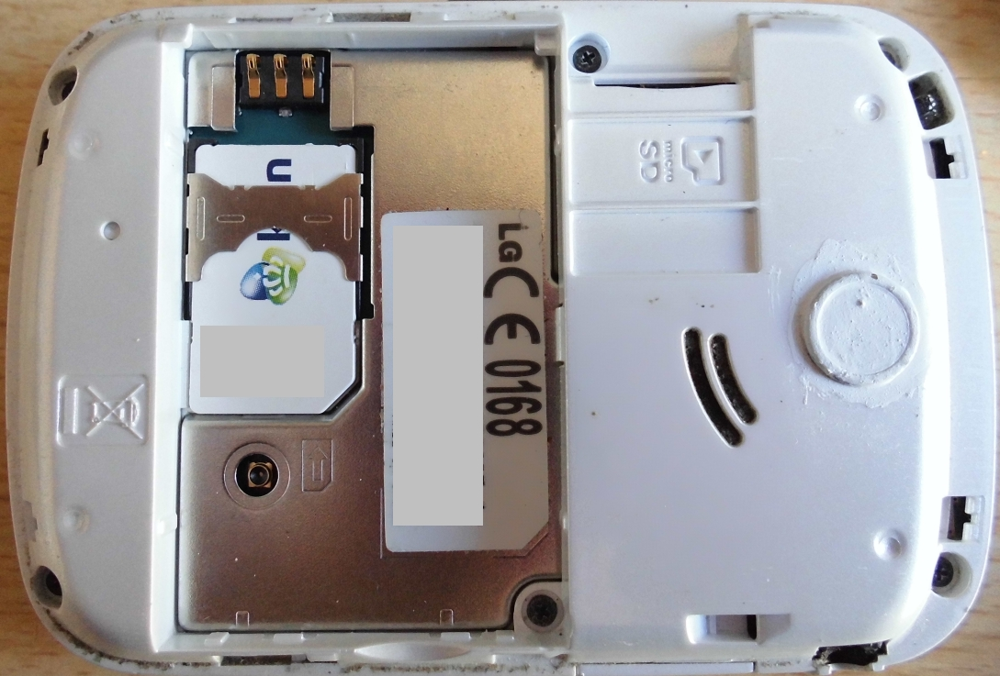

# GeenEenTwee

The GeenEenTwee is [one of my 'machines'](https://github.com/richelbilderbeek/Machines) 
that prevents a mobile phone from turning on. 

I noticed that my phone turns on and calls the emergency number when I put it turned off in my pocket. 
Removing the battery is not an option: I don't want to lose it or damage it.

The name 'GeenEenTwee' is a pun on the Dutch emergency number 112, which is spelled out as 'Een een twee'. An equivalent English name would be 'NighOneOne'.

# Creating a GeenEenTwee

 * Cut out a piece of sturdy paper in a rectangle sized 3 cm x 5 cm
 * Add addhesive tape at one of the smaller edges

# Using a GeenEenTwee

Open a phone and find where the battery is located. Remove the battery.

Put the GeenEenTwee over the battery pins.

Put the battery back in.

# Storing a GeenEenTwee

Open a phone and find where the battery is located. Put the GeenEenTwee above the battery.

